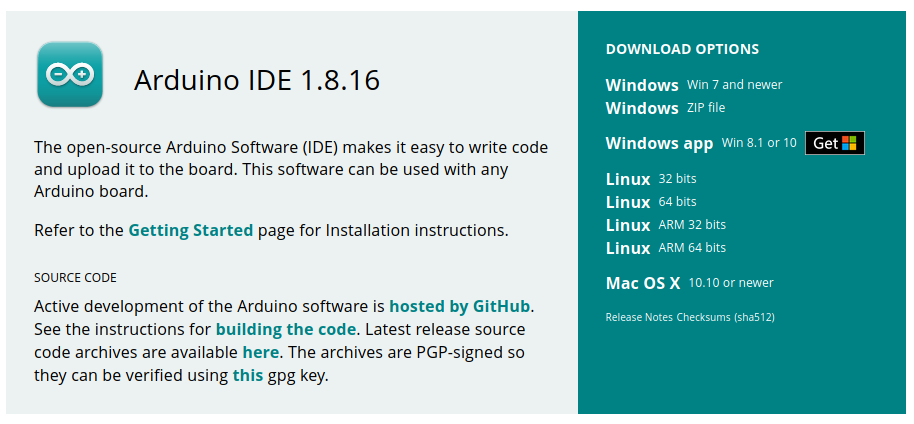

# Downloading And Installing The Arduino IDE

Before uploading the Telemetrix4Connect2040 server to the Arduino Nano RP2040 Connect,
you need to update the sketch to contain your network's SSID and password.

The [Arduino IDE](https://www.arduino.cc/en/software) is used to do this, so you 
need to download it and install it on your PC. 

Select the version for your platform.

 
 
Copyright (C) 2021 Alan Yorinks. All Rights Reserved.
