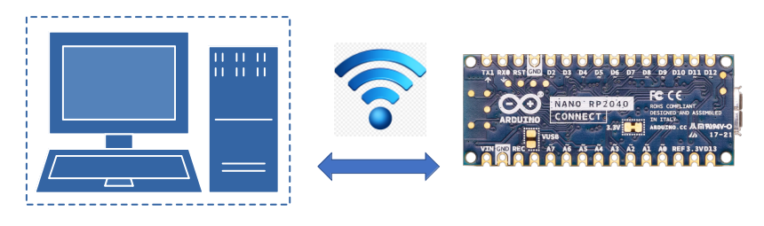

<div style="text-align:center;color:#990033; font-family:times, serif;font-size:2.5em"><i>Telemetrix-Nano-2040-WiFi</i></div>

<div style="text-align:center;color:#990033; font-family:times, serif;font-size:2.5em"><i>Tmx-Nano-2040-WiFi-AIO</i></div>

<div style="text-align:center;color:#990033; font-family:times, serif;font-size:3.5em"><i>User's Guide</i></div>


<div style="text-align:center;color:#990033; font-family:times, serif;font-size:2.5em"><i>Using Python To Remotely Access The</i></div>
<div style="text-align:center;color:#990033; font-family:times, serif;font-size:2.5em"><i>Arduino Nano RP2040 Connect</i></div>




<br>

The Telemetrix-Nano-2040-WiFi and Tmx-Nano-2040-WiFi-AIO Python APIs allow you to 
access an Arduino Nano RP2040 Connect using Python running on your PC via Wi-Fi 
connectivity. 
Telemetrix-Nano-2040-WiFi uses threading to implement concurrency, while Tmx-Nano-2040-WiFi-AIO
uses Python asyncio for its concurrency model.

All programming of The Arduino Connect is performed using either of the 
two Python client APIs. A fixed server sketch is loaded onto the Arduino Connect 
that accepts client commands and autonomously reports any detected data changes.

# Summary Of Major Features:
## GPIO And Sensor/Actuator Support:
* Analog Input
* Analog (PWM) Output
* Digital Input
* Digital Output
* I2C Communications Protocol
* SPI Communications Protocol
* Onboard IMU (Accelerometer and Gyroscope)
* Onboard Microphone
* Onboard RGB LED
* HC-SR04 Type Distance Sensors
* DHT Temperature/Humidity Sensors
* NeoPixels
* Servo Motors
* All Data change events are reported asynchronously via user registered callback 
  functions and are timestamped. 
* Integrated server debugging facilities are included. 

## Online Reference Documentation
* Online [API Reference Documentation for Telemetrix-Nano-2040-WiFi](https://htmlpreview.github.io/?https://github.com/MrYsLab/telemetrix-nano-2040-wifi/blob/master/html/tmx_nano2040_wifi/index.html).

* Online [API Reference Documentation for Tmx-Nano-2040-WiFi-AIO](https://htmlpreview. github.io/?https://github.com/MrYsLab/tmx-nano-2040-wifi-aio/blob/master/html/tmx_nano2040_wifi_aio/index.html).

* A full set of working examples for [Telemetrix-Nano-2040-WiFi](https://github.com/MrYsLab/telemetrix-nano-2040-wifi/tree/master/examples) and [Tmx-Nano-2040-WiFi-AIO](https://github.com/MrYsLab/tmx-nano-2040-wifi-aio/tree/master/examples)
are available for download online. 

## A Quick Example For Telemetrix-Nano-2040-WiFi


```python


import sys
import time

from tmx_nano2040_wifi import tmx_nano2040_wifi

"""
Monitor a digital input pin with pullup enabled
"""

"""
Setup a pin for digital input and monitor its changes
"""

# Callback data indices
CB_PIN_MODE = 0
CB_PIN = 1
CB_VALUE = 2
CB_TIME = 3


def the_callback(data):
    """
    A callback function to report data changes.
    This will print the pin number, its reported value and
    the date and time when the change occurred

    :param data: [pin mode, pin, current reported value, pin_mode, timestamp]
    """
    date = time.strftime('%Y-%m-%d %H:%M:%S', time.localtime(data[CB_TIME]))
    print(f'Report Type: {data[CB_PIN_MODE]} Pin: {data[CB_PIN]} '
          f'Value: {data[CB_VALUE]} Time Stamp: {date}')

# Instantiate teh TmxNano2040WiFi class supplying the IP address of the Nano
board = tmx_nano2040_wifi.TmxNano2040Wifi(ip_address='192.168.2.246')

# Set the pin mode and register the callback
board.set_pin_mode_digital_input_pullup(11, the_callback)

try:
    # kill time while waiting for data changes
    while True:
        time.sleep(5)

except KeyboardInterrupt:
    board.shutdown()
    sys.exit(0)


```

Sample console output as input change events occur:

```bash
Report Type: 2 Pin: 11 Value: 1 Time Stamp: 2021-09-24 16:30:19
Report Type: 2 Pin: 11 Value: 0 Time Stamp: 2021-09-24 16:30:23
```

## A Quick Example For Tmx-Nano2040-WiFi-AIO

``` python

import asyncio
import sys
import time

from tmx_nano2040_wifi_aio import tmx_nano2040_wifi_aio

"""
Monitor a digital input pin
"""

"""
Setup a pin for digital input and monitor its changes
"""

# Setup a pin for analog input and monitor its changes
DIGITAL_PIN = 11  # arduino pin number

# Callback data indices
CB_PIN_MODE = 0
CB_PIN = 1
CB_VALUE = 2
CB_TIME = 3


async def the_callback(data):
    """
    A callback function to report data changes.
    This will print the pin number, its reported value and
    the date and time when the change occurred

    :param data: [pin_mode, pin, current reported value, timestamp]
    """
    date = time.strftime('%Y-%m-%d %H:%M:%S', time.localtime(data[CB_TIME]))
    print(f'Pin: {data[CB_PIN]} Value: {data[CB_VALUE]} Time Stamp: {date}')


async def digital_in(my_board, pin):
    """
     This function establishes the pin as a
     digital input. Any changes on this pin will
     be reported through the call back function.

     :param my_board: a tmx_nano2040_wifi_aio instance
     :param pin: Arduino pin number
     """

    # set the pin mode and register the callback
    await my_board.set_pin_mode_digital_input(pin, the_callback)

    while True:
        try:
            # kill time waiting for data change notifications
            await asyncio.sleep(.001)
        except KeyboardInterrupt:
            await board.shutdown()
            sys.exit(0)

# get the event loop
loop = asyncio.get_event_loop()

# instantiate tmx_nano2040_wifi_aio
board = tmx_nano2040_wifi_aio.TmxNano2040WifiAio(ip_address='192.168.2.246')

try:
    # start the main function
    loop.run_until_complete(digital_in(board, DIGITAL_PIN))
except (KeyboardInterrupt, RuntimeError) as e:
    loop.run_until_complete(board.shutdown())
    sys.exit(0)

```


