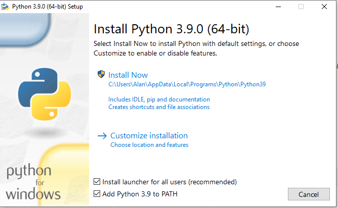

# This package requires Python 3.7 or greater.

## Verifying The Installed Python Version Number
To check that you have the correct version of Python 3 installed,
open a command window and type:

```
python3 -V
```

For Windows, you may need to type:

```
python -V
```

The Python version is displayed:

```
python3
Python 3.7.2 (default, Dec 31 2018, 14:25:33)
[GCC 8.2.0] on linux
Type "help", "copyright", "credits" or "license" for more information.
>>>
```

For Windows users, this may look something like this:
```

C:\Users\Alan>python
Python 3.9.0 (tags/v3.9.0:9cf6752, Oct  5 2020, 15:34:40) [MSC v.1927 64 bit (AMD64)] on win32
Type "help", "copyright", "credits" or "license" for more information.
>>>
```
If you need to install Python 3:

## INSTALLING PYTHON 
### Windows Users


To install Python 3, go to the
<a href="https://www.python.org/" target="_blank">Python home page,</a>
and download the latest Python 3 distribution for your operating system.

If there is a checkbox to add Python 3 to your path during the installation 
process, check it before installing.



### Linux Users

#### Raspberry Pi Raspbian Users
If your copy of Raspbian is using Python 3.7 or greater, you should be all set to proceed.

#### Ubuntu and Other Debian Based Linux Distributions

You may need to install pip3. To check, open a terminal and type:
```python
which pip3
```
If a path to pip3 is not reported, you will need to install it.

Open a terminal window and type:
```
  sudo apt-get install pip3-python
```

You should then make sure you have the latest version by typing:
```python
sudo pip3 install -U pip
```

#### For All Other Linux Distributions

Refer to your distribution's instructions.

### Mac Users
Python 3.7.2 or greater is required.


1. Install Python 3.7.x from [https://www.python.org/downloads/](https://www.python.org/downloads/)
 or via [homebrew](http://brew.sh/)
2. Download get-pip.py from [https://bootstrap.pypa.io/get-pip.py](https://bootstrap.pypa.io/get-pip.py) and
install (this should already be installed if Python was installed from python.org or homebrew):

```
curl -O https://bootstrap.pypa.io/get-pip.py
sudo python3 get-pip.py
```


### Verify The Python Installation

Use the [procedure above](#verifying-the-installed-python-version-number) to verify that you have successfully
installed the correct version of Python for your
computer.

