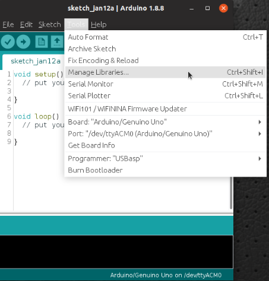
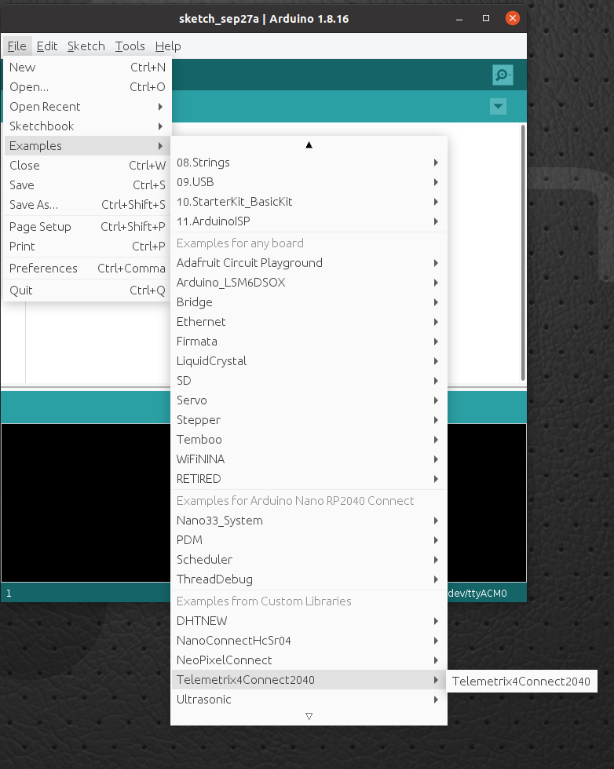
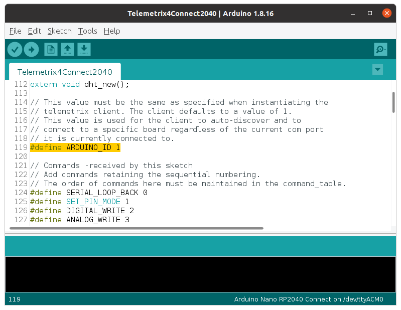

# [Telemetrix4Connect2040](https://github.com/MrYsLab/Telemetrix4Connect2040) Installation

To install the server, we will need to:

* Install the server library into the Arduino IDE.
* Modify the server sketch to contain the SSID and Password of your network.
* Optionally modify the ID value of the server.
* Upload the modified sketch to the Arduino Nano RP2040 Connect.
* Understand the RGB LED Indications.
* Retrieve the IP address assigned to the Arduino Nano RP2040 Connect.
* Run the loop_back example to assure that the installation was successful.

## Adding The Server To The Arduino IDE

Open the Arduino IDE and select Tools/Manage Libraries.



Enter "Telemetrix4Connect2040 in the search box.


Click on the Install button. You will be prompted to allow the installation
of additional libraries. Accept the installation for all.

## Install Telemetrix4Connect2040 Into The IDE Editor

From the _main menu_ of the IDE, select:

File/Examples/Telemetrix4Connect2040/Telemetrix4Connect2040.



The sketch should now be available in the editor.

## Edit The Sketch To Contain Your Network SSID And Password


Using the IDE editor, locate the comment line that contains:

```python
// Modify the next two lines to match your network values
```
Replace YOUR_SSID and PASSWORD with the actual values for your network. 
Make sure that you retain the quotation marks.

Save the sketch. You may be asked to rename it. This will retain the original
version, and the renamed version will contain your changes.

## Setting The Telemetrix4Arduino Instance ID

Telemetrix4Connect2040, in conjunction with the project clients, associates a 
specific Arduino board with your application.

If you only have a single Arduino connected at a time, you do not need to do anything. 

However,
if you wish to run multiple Arduino's, you must assign a unique ID number to each
Arduino. The ID number is then supplied as an input parameter when your application
 is instantiated.



Save your changes.

### Matching The ID In Your Application

Your application must use the same ID set in the server. If you did not
change the instance id, then your application can accept the default value. However, if 
you did 
change it, you must set the 
instance id when 
instantiating the client class.

```python
    def __init__(self, arduino_wait=.01,
                 instance_id=1,
                 sleep_tune=0.000001,
                 shutdown_on_exception=True,
                 reset_board_on_shutdown=True,
                 ip_address=None, ip_port=31335):

        """
        In general, you may accept all of the default parameter values.

        :param arduino_wait: wait time for Arduino to reset itself.
                             The time is specified in seconds. Increase
                             this value if your application does not
                             locate the Nano Connect.

        :param instance_id: value must match the value set in the server. It
                            is used to identify the connected Arduino.

        :param sleep_tune: A tuning parameter (typically not changed
                           the by user)

        :param shutdown_on_exception: call shutdown before raising
                                      a RunTimeError exception, or
                                      receiving a KeyboardInterrupt exception.
                                      Set this to False if you wish to handle
                                      exceptions and not shut down the application.

        :param reset_board_on_shutdown: if True, a hardware reset  of the board is
                                        performed when the shutdown method is called.
                                        If set to False, restarting your program may
                                        not work as expected since onboard
                                        devices may no longer respond. Resetting the
                                        board solves this issue.

        :param ip_address: ip address of tcp/ip connected device.
                           This parameter is required to be supplied.

        :param ip_port: ip port of tcp/ip connected device. In general
                        you do not need to alter the default value.
        """
```
## Compile And Upload The Server To The Arduino Nano Connect

Press the upload arrow on the IDE.


## The RGB LED Status And Obtaining The IP Address Assigned To The Arduino Nano

After the upload completes, within a few moments, the RGB LED should glow green.
This indicates that there was a successful handshake between the Arduino and the network.

If the RGB is red, check that you modified the server sketch correctly for the network 
SSID 
and 
Password.

If the RGB LED is green, enable the Arduino serial monitor, and repower the Arduino.
The serial monitor will indicate the IP address assigned to the Arduino Nano RP2040 Core.


Make a note of this address. It needs to be specified when instantiating a client class 
in your application.

```python
# Create a Telemetrix instance.
board = tmx_nano2040_wifi.TmxNano2040Wifi(ip_address='192.168.2.246')
```
## Run The Loop_Back Example

### For Telemetrix-Nano-2040-WiFi
Copy the following example and run it using Python3.

```python
"""
 Copyright (c) 2021 Alan Yorinks All rights reserved.

 This program is free software; you can redistribute it and/or
 modify it under the terms of the GNU AFFERO GENERAL PUBLIC LICENSE
 Version 3 as published by the Free Software Foundation; either
 or (at your option) any later version.
 This library is distributed in the hope that it will be useful,
 but WITHOUT ANY WARRANTY; without even the implied warranty of
 MERCHANTABILITY or FITNESS FOR A PARTICULAR PURPOSE.  See the GNU
 General Public License for more details.

 You should have received a copy of the GNU AFFERO GENERAL PUBLIC LICENSE
 along with this library; if not, write to the Free Software
 Foundation, Inc., 51 Franklin St, Fifth Floor, Boston, MA  02110-1301  USA
"""

import time
import sys
from tmx_nano2040_wifi import tmx_nano2040_wifi

"""
Loopback some data to assure that data can be sent and received between
the Telemetrix client and Telemetrix server.
"""


def the_callback(data):
    """
    A callback function to report the looped back data

    :param data: [looped back data]
    """
    print(f'Looped back: {chr(data[0])}')


def loop_back(my_board, loop_back_data):
    """
    This function will request that the supplied characters be
    sent to the board and looped back and printed out to the console.

    :param my_board: a tmx_nano2040_wifi instance
    :param loop_back_data: A list of characters to have looped back
    """
    try:
        for data in loop_back_data:
            my_board.loop_back(data, callback=the_callback)
            print(f'Sending: {data}')
        time.sleep(.2)
    except KeyboardInterrupt:
        board.shutdown()
        sys.exit(0)


board = tmx_nano2040_wifi.TmxNano2040Wifi(ip_address='192.168.2.246')
char_list = ['A', 'B', 'Z']
try:
    loop_back(board, char_list)
    time.sleep(.2)
    board.shutdown()
    sys.exit(0)
except KeyboardInterrupt:
    board.shutdown()
    sys.exit(0)

```
Sample output:
```python
$ python3 loop_back.py
TmxNano2040Wifi:  Version 1.0

Copyright (c) 2021 Alan Yorinks All Rights Reserved.


Waiting 0.01 seconds(arduino_wait) for Arduino devices to reset...
Establishing IP connection...
Successfully connected to: 192.168.2.246:31335

Retrieving Telemetrix4Connect2040 firmware ID...
Telemetrix4Connect2040 firmware version: 1.0.0
Sending: A
Sending: B
Sending: Z
Looped back: A
Looped back: B
Looped back: Z

```

### For Tmx-Nano2040-WiFi-AIO
Copy the following example and run it using Python3.
```python
"""
 Copyright (c) 2021 Alan Yorinks All rights reserved.

 This program is free software; you can redistribute it and/or
 modify it under the terms of the GNU AFFERO GENERAL PUBLIC LICENSE
 Version 3 as published by the Free Software Foundation; either
 or (at your option) any later version.
 This library is distributed in the hope that it will be useful,
 but WITHOUT ANY WARRANTY; without even the implied warranty of
 MERCHANTABILITY or FITNESS FOR A PARTICULAR PURPOSE.  See the GNU
 General Public License for more details.

 You should have received a copy of the GNU AFFERO GENERAL PUBLIC LICENSE
 along with this library; if not, write to the Free Software
 Foundation, Inc., 51 Franklin St, Fifth Floor, Boston, MA  02110-1301  USA
"""

import asyncio
import sys
import time
from tmx_nano2040_wifi_aio import tmx_nano2040_wifi_aio
from tmx_nano2040_wifi_aio import telemetrix_aio_socket

"""
Loopback some data to assure that data can be sent and received between
the Telemetrix client and arduino-telemetrix server.
"""


async def the_callback(data):
    """
    A callback function to report the looped back data

    :param data: [looped back data]
    """
    print(f'Looped back: {chr(data[0])}')


async def loop_back(my_board, loop_back_data):
    """
    This function will request that the supplied characters be
    sent to the board and looped back and printed out to the console.

    :param my_board: a tmx_nano2040_wifi_aio instance
    :param loop_back_data: A list of characters to have looped back
    """
    try:
        for data in loop_back_data:
            await my_board.loop_back(data, callback=the_callback)
            print(f'Sending: {data}')
            await asyncio.sleep(.1)
        await asyncio.sleep(.1)
    except KeyboardInterrupt:
        my_board.shutdown()
        sys.exit(0)

# get the event loop
loop = asyncio.get_event_loop()

# instantiate
board = tmx_nano2040_wifi_aio.TmxNano2040WifiAio(ip_address='192.168.2.246')
char_list = ['A', 'B', 'Z']
try:
    # start the main function
    loop.run_until_complete(loop_back(board, char_list))
    time.sleep(.1)
    loop.run_until_complete(board.shutdown())

except KeyboardInterrupt:
    loop.run_until_complete(board.shutdown())
    sys.exit(0)


```

Sample Output

```python
python3 loop_back.py
TmxNano2040Wifi:  Version 1.0

Copyright (c) 2021 Alan Yorinks All Rights Reserved.


Waiting 0.01 seconds(arduino_wait) for Arduino devices to reset...
Establishing IP connection...
Successfully connected to: 192.168.2.246:31335

Retrieving Telemetrix4Connect2040 firmware ID...
Telemetrix4Connect2040 firmware version: 1.0.0
Sending: A
Looped back: A
Sending: B
Looped back: B
Sending: Z
Looped back: Z

```
